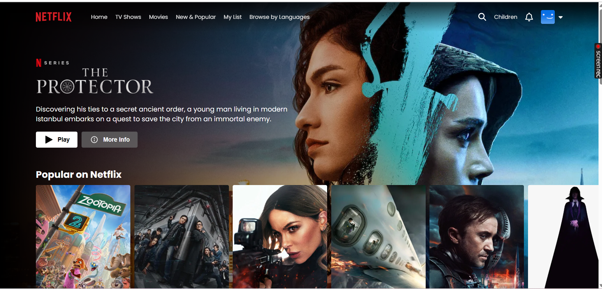

# 🎬 Netflix Clone – React + Vite

A fully responsive **Netflix Clone** built using **React + Vite**, featuring dynamic movie listings, authentication UI, and modern UI components.
This project replicates the **landing page, login page, and movie browsing experience** of Netflix.

---

## 🚀 Features

### 🎨 UI/UX

* Real Netflix-style homepage
* Banner section with featured movie
* Horizontal carousels (Trending, Popular, New Releases, etc.)
* Fully responsive for mobile, tablet & desktop
* Login page UI similar to Netflix

### 🔧 Tech Stack

* **React + Vite** (Fast dev & optimized production build)
* **TMDB Movies API** *(if implemented)*
* **Axios** for API calls
* **React Router** for navigation
* **CSS / Tailwind** for styling

---

## 📸 Screenshots

### 🏠 Home Page

(Insert your image here)

```
## Test



```

### 🔐 Login Page

(Insert your image here)

```


```

---

## 📁 Folder Structure

```
Netflix-Clone/
│── public/
│── src/
│   ├── components/
│   │   ├── Navbar.jsx
│   │   ├── Banner.jsx
│   │   ├── Row.jsx
│   ├── pages/
│   │   ├── Home.jsx
│   │   ├── Login.jsx
│   ├── utils/
│   │   ├── requests.js
│   │   ├── axios.js
│   ├── App.jsx
│   ├── main.jsx
│── .env
│── package.json
│── vite.config.js
│── README.md
```

---

## ⚙️ Installation & Setup

### 1️⃣ Clone the repository

```sh
git clone https://github.com/yourusername/netflix-clone.git
cd netflix-clone
```

### 2️⃣ Install dependencies

```sh
npm install
```

### 3️⃣ Add API key

Create a `.env` file:

```sh
VITE_TMDB_API_KEY=YOUR_KEY_HERE
```

### 4️⃣ Start development server

```sh
npm run dev
```

### 5️⃣ Build for production

```sh
npm run build
```

---

## 🔗 API Integration (TMDB)

If using The Movie Database API:

1. Create your API key at
   [https://www.themoviedb.org/settings/api](https://www.themoviedb.org/settings/api)
2. Add it inside `.env`
3. Use Axios:

```js
const url = `/trending/all/week?api_key=${import.meta.env.VITE_TMDB_API_KEY}`;
```

---

## 📦 Deployment

This project can be deployed on:

* **Vercel** (recommended)
* Netlify
* Cloudflare Pages
* GitHub Pages

Build and deploy:

```sh
npm run build
```

Then upload the `dist/` folder to any hosting provider.

---


## ⭐ If you like this project

Give the repository a **star** ⭐ on GitHub!

---
